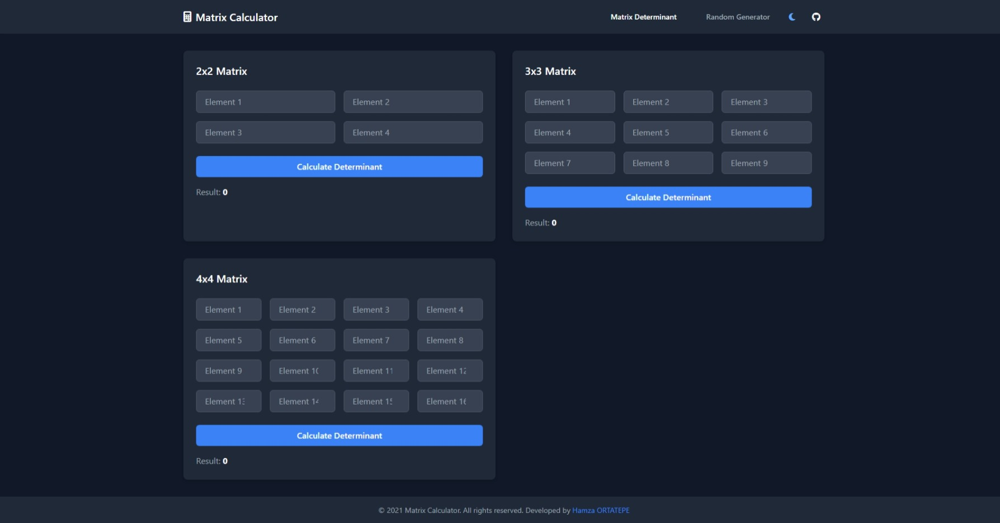
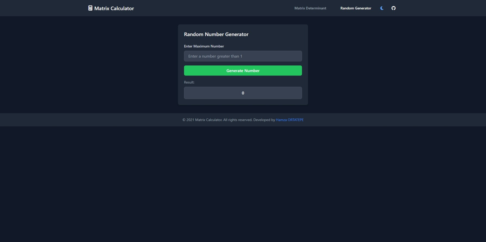
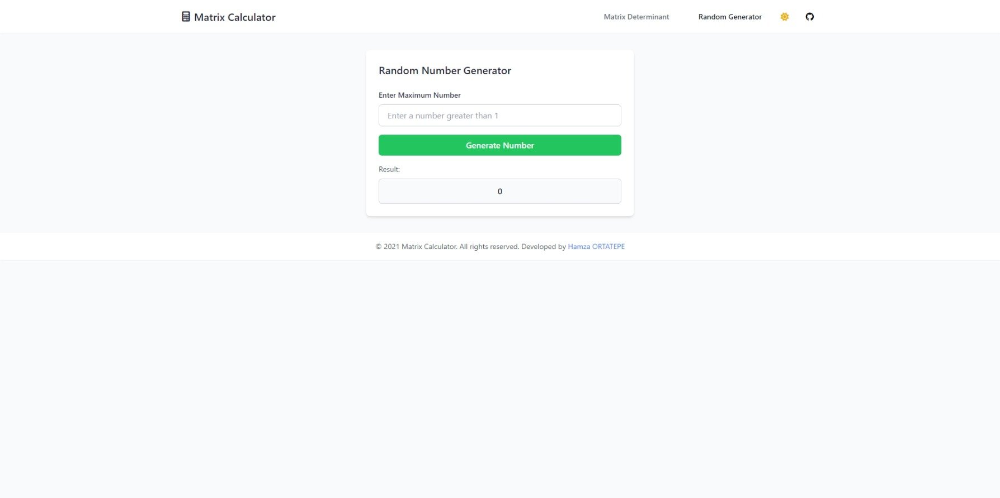

# Matrix Calculator & Random Number Generator

A web-based calculator application for matrix operations and random number generation built with Python, Socket.IO and modern frontend technologies.

## Features

- Matrix determinant calculations:
  - 2x2 matrices
  - 3x3 matrices  
  - 4x4 matrices
- Random number generator with custom range
- Dark/Light theme toggle
- Modern responsive UI
- Real-time calculations via WebSocket

## Tech Stack

- **Backend:**
  - Python
  - FastAPI
  - Socket.IO
  - NumPy

- **Frontend:**
  - HTML/CSS
  - JavaScript
  - Tailwind CSS
  - jQuery
  - Socket.IO Client
  - Font Awesome

## Installation

1. Create and activate virtual environment:
```bash
python -m venv venv
venv\Scripts\activate
```
2. Install dependencies:
```bash
pip install -r requirements.txt
```
3. Run the server:
```bash
python main.py
```
4. Open `index.html` in your browser.

## Screenshots
### Dark Theme


### Light Theme



## License

This project is licensed under the MIT License - see the [LICENSE](LICENSE) file for details.